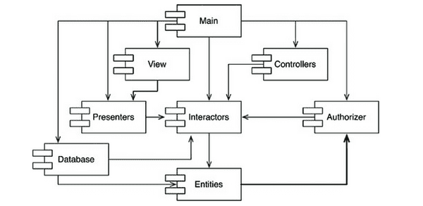
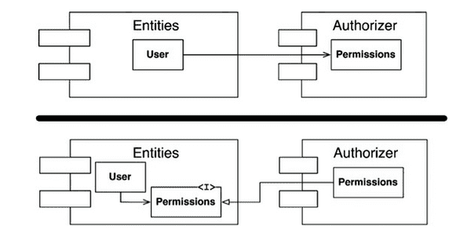
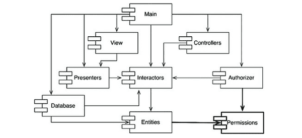
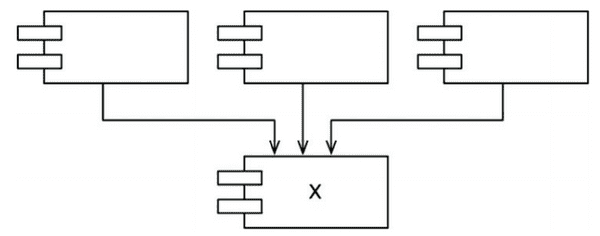
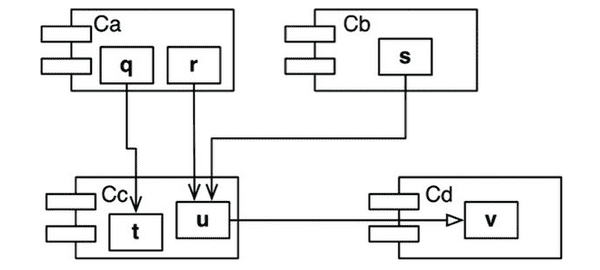
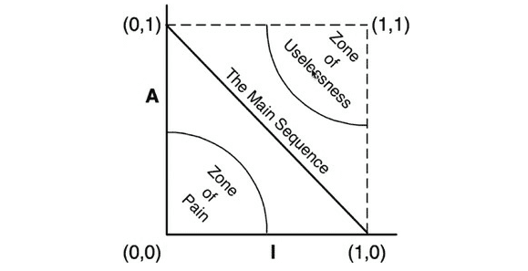

# 14장 - 컴포넌트 결합

컴포넌트 사이 관계의 세 가지 원칙

# ADP: 의존성 비순환 원칙

> 컴포넌트 의존성 그래프에 순환(cycle)이 있어서는 안 된다.
> 

### 숙취 증후군 (the morning after syndrome)

- 내가 의존한 무언가를 다른 사람이 수정하면서 망가진 코드를 다시 수정하는 작업을 반복하는 과정
- 주 단위 빌드와 의존성 비순환 원칙이 해결책
- 주 단위 빌드 (weekly build)
    - 일주일의 첫 4일동안은 개발자들은 서로를 신경 쓰지 않는다.
    - 금요일이 되면 변경된 코드를 모두 통합하여 시스템을 빌드
    - 4일동안 개발자들이 고립된 채로 개발할 수 있다는 장점이 있지만 금요일에 모든 업보를 치뤄야 한다는 단점이 있다
    - 중간 규모 프로젝트에서는 가능하지만 프로젝트 규모가 커지면 금요일 하루로는 합치는 게 불가능해지고 통합하는 주기가 늘어나면서 팀의 효율성이 낮아진다.
- 순환 의존성 제거하기
    - 개발 환경을 릴리스 가능한 컴포넌트 단위로 분리
    - 컴포넌트 별로 단일 개발자, 단일 팀이 개발하고 해당 컴포넌트를 릴리스하여 다른 개발자가 사용할 수 있도록 한다.
    - 다른 팀은 새 릴리스를 적용할 준비가 되었을 때 릴리스를 사용하기 때문에 특정 컴포넌트가 변경되더라도 다른 팀에 즉각 영향을 주지 않는다.  → 통합이 작고 점진적으로 이뤄짐
    - 의존성 구조에 순환이 있어서는 안됨
        - 컴포넌트 간 의존성 구조를 그리면 DAG(Directed Acyclic Graph)가 나와야 한다.
        - 해당 컴포넌트 릴리스에 영향받는 팀을 쉽게 찾을 수 있음
            - Main → View → Presenter 순으로 의존하고 있다면 Presenter가 변경되면 View와 Main이 영향을 받는다. 반면 Main은 변경되어도 영향받는 컴포넌트가 없다.
        - 시스템 빌드 구조를 파악할 수 있음
            - 의존하는 게 없는 Entities부터 빌드하면서 의존받는 게 없는 Main까지 컴파일, 테스트, 릴리스한다.

## 순환이 컴포넌트 의존성 그래프에 미치는 영향

- Authorizer → Interactors → Entities → Authorizer 로 순환 구조가 형성되었다고 하자
- Entities를 사용하는 Database 컴포넌트를 릴리스하려면 Entities와 Entities가 의존하고 있는 Authorizer, Authorizer가 의존하고 있는 Interactors까지 다 릴리스 해야 한다.
- Authorizer, Interactors, Entities 이 세 컴포넌트가 하나의 거대한 컴포넌트가 되어버림

### 순환 끊기

1. 의존성 역전 원칙 (DIP)를 사용한다.

1. Entities와 Authorizer가 모든 의존하는 새로운 컴포넌트를 만듦
    
    
    
    - 흐트러짐 (Jitters)
        - 요구사항이 변경되면 컴포넌트의 의존성 구조는 서서히 흐트러지며 성장한다.
        - 의존성 순환이 발생하는지 항상 관찰하여야 한다.

## 하향식  (Top-down) 설계

- 컴포넌트는 시스템에서 가장 먼저 설계할 수 있는 대상이 아니라 하향식으로 설계될 수 없다.
- 컴포넌트 의존성 다이어그램
    - 애플리케이션의 기능을 기술하는 일과는 거의 관련이 없다.
    - 어플리케이션의 빌드 가능성과 유지보수성을 보여주는 지도
    - 점차 모듈과 클래스가 쌓이면서 재사용 가능한 요소를 만들고 변동성을 분리하기 위해 의존성 구조를 만드는 것
        - 초반에 구조를 잘 알지 못할 때 만들려 하면 실패할 수도
        - 시스템의 논리적 설계에 맞춰 성장하고 진화해야함

---

# SDP: 안정된 의존성 원칙

> 안정성의 방향으로 (더 안정된 쪽에) 의존하라
> 
- 설계에서 변경은 불가피하다
- 변동성을 지니도록 컴포넌트를 설계 → 다른 컴포넌트가 의존성을 가지게 되면 변경하기 어려워짐
    - SDP는 변경하기 어려운 모듈이 변경하기 쉬운 모듈에 의존하지 않도록 만드는 원칙

## 안정성

- 컴포넌트를 변경하기 어렵게 만드는 법 → 수많은 다른 컴포넌트가 해당 컴포넌트에 의존하게 만드는 것
    
   

    
- X는 안정적이며 세 컴포넌트를 책임지는 책임성이 있고 X가 의존하는 것은 없으므로 독립적이다
- 반대라면 책임성이 없고 의존적인 것

## 안정성 지표

- 의존성의 개수를 세어보는 방법
- Fan-in
    - 안으로 들어오는 의존성. 컴포넌트 내부 클래스에 의존하는 컴포넌트 외부의 클래스 개수
- Fan-out
    - 바깥으로 나가는 의존성. 컴포넌트 외부 클래스에 의존하는 컴포넌트 내부 클래스의 개수
- I( 불안정성) = Fan-out / (Fan-in + Fan-out)
    - 0이면 안정된 컴포넌트, 1이면 불안정한 컴포넌트

- Cc
    - Fan-in =3
    - Fan-out =1
    - I = 1 / (3+1) = 1 / 4

- SDP에서 I 지표는 컴포넌트가 의존하는 다른 컴포넌트들의 I보다 커야 한다. (Ca보다 Cc의 I지표가 작아야 한다.)

## 모든 컴포넌트가 안정적이어야 하는 것은 아니다

- 모든 컴포넌트가 안정적이라면 시스템 변경이 불가능하다

## 추상 컴포넌트

- 인터페이스만 포함하는 컴포넌트
- 정적 타입 언어를 사용할 때 자주 사용하고 꼭 필요한 전략
- 추상 컴포넌트는 상당히 안정적

---

# SAP: 안정된 추상화 원칙

> 컴포넌트는 안정된 정도만큼만 추상화되어야 한다.
> 
- 고수준 아키텍처나 업무 로직에 관련된 컴포넌트는 변동이 없기를 바란다.
    - 하지만 고수준 정책을 포함하는 소스 코드는 수정하기가 어려워지면서 시스템이 유연함을 잃는다.
    - 안정되면서도 변동에 유연하게 만들 수는 없을까? → OCP에서 해답을 얻음
    - 추상 클래스를 통해서 OCP를 따름

## 안정된 추상화 원칙

- 안정성과 추상 화 정도 사이의 관계를 정의
- 안정된 컴포넌트 = 추상 컴포넌트, 불안정한 컴포넌트 = 구체 컴포넌트

## 추상화 정도 측정하기

- 컴포넌트 클래스 총 수(Nc) 대비 인터페이스와 추상 클래스의 개수(Na)
- A의 추상화 정도 = Na / Nc

## 주계열

- 안정성과 추상화 정도 사이의 관계
    
    

    
- 최고로 안정적이고 추상화된 컴포넌트 = (0,1)
- 최고로 불안정하고구체화된 컴포넌트 = (1,0)
- 추상 클래스로부터 파생된 추상 클래스 = 추상적이면서 의존성을 가짐 → 그래프 공간 어딘가에 위치

### 고통의 구역 (zone of pain)

- 이 구역의 컴포넌트들은 매우 안정적이며 구체적
    - 추상적이지 않으므로 확장할 수 없고 안정적이므로 변경하기도 어렵다
    - 배제해야 할 구역
    - ex. 데이터베이스 스키마, 유틸리티 라이브러리(String class)

### 쓸모없는 구역 (zone of uselessness)

- 이 구역 컴포넌트들은 추상적이면서 의존하지 않음
    - ex. 누구도 구현하지 않은 추상 클래스

### 배제 구역 벗어나기

- 변동성이 큰 컴포넌트들은 두 배제구역에서 벗어나야 함
    - (1,0) ~ (0,1)을 잇는 선문위에 있으면 좋음 → 이 선분을 주계열(main sequence)라 부른다.
    

### 주계열과의 거리

- 주계열로부터 컴포넌트가 얼마나 떨어져 있는가
- D 거리 = |A+I -1|
    - D가 0이면 컴포넌트가 주계열 위에 있다. 1이면 가장 멀리 떨어져있다.
- 컴포넌트들의 D 거리를 구하여 0에 가깝지 않거나 혼자 멀리 떨어져 있는 이상한 경우, 재검토 후 재구성할 수 있다.
- D 지표를 시간에 따라 그려볼 수도 있다.
    - 해당 컴포넌트가 주계열에서 벗어난 원인과 지점을 알 수 있다.

---

# 결론

- 의존성 관리 지표는 설계의 의존성과 추상화 정도보다 내가 생각한 ‘훌륭한’ 패턴 수준에 얼마나 잘 부합하는지를 측정
- 하지만 지표도 임의로 결정된 표준을 기초로 한 측정값 → 불완전하다.
