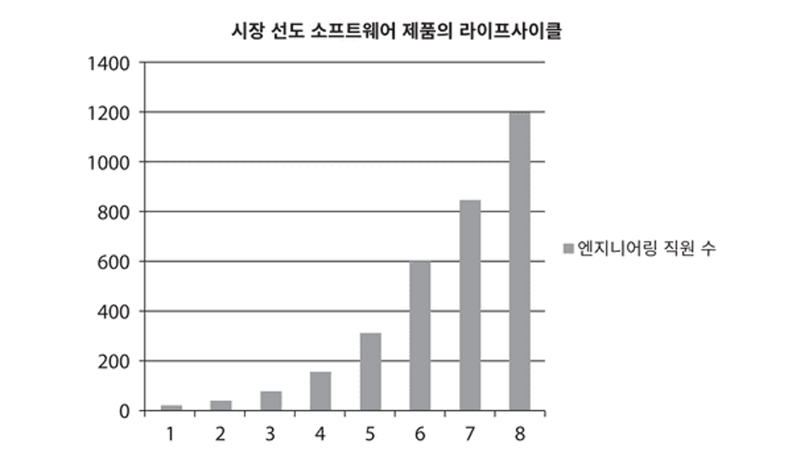
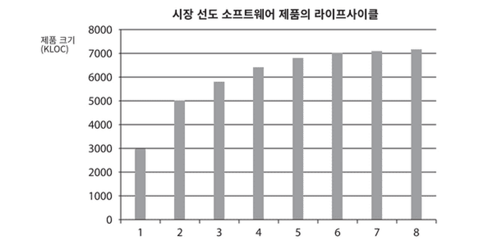
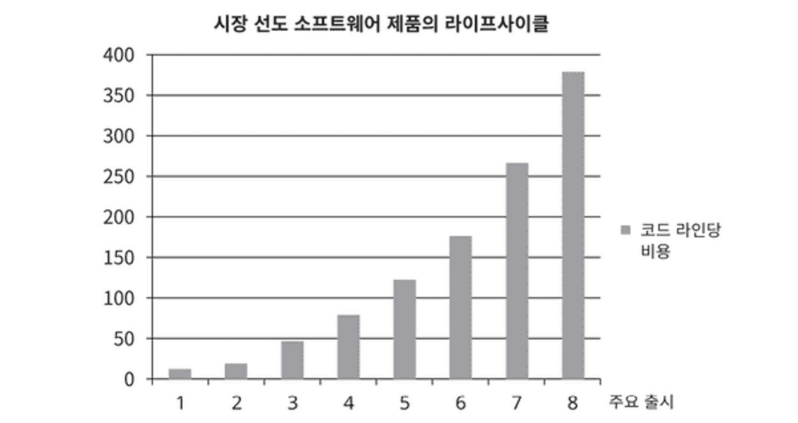

# 1장 설계와 아키텍처란
## 설계와 아키텍처의 차이는 없다
<일반적인 경우>  
설계 : 저수준의 구조/결정 사항  
아키텍처 : 저수준의 세부사항과는 다른 고수준의 무언가  
- 설계와 아키텍처는 개별로 존재할 수 없으며, 서로 연결된 것이다  
고수준의 아키텍처 속에는 이미 저수준의 설계가 포함돼있다
## 개발자는 절대로 태세를 전환하지 않는다
 

- 쓰레기같은 코드가 쌓여서 코드의 생산성이 점점 떨어지는 예이다
- 나중에 바꾸겠다는 다짐이 지켜지지 않고 계속된 상황을 보여준다  
- 결국 제대로 된 아키텍처와 코드를 구현하는 것이 제일 빠른 개발 방식이다