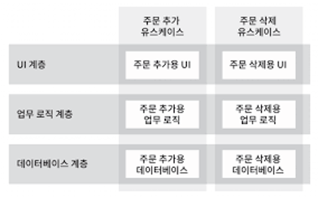

# 16장 독립성

> ### 좋은 아키텍처는 시스템의 유스케이스, 운영, 개발, 배포를 지원해야한다

## 유스케이스(use case)란?

- 시스템의 동작을 사용자 입장에서 표현한 시나리오
- 시스템의 요구사항을 알아내는 과정
- 개발자보다 사용자의 입장에서 이해하기 쉽고 간단하게 작성되어야 함
- 흐름도 X (데이터를 고려하지 않음)
- How 보다는 What에 대한 질문의 대답

## 유스케이스를 지원해야한다

- 시스템 아키텍처는 시스템의 의도를 지원해야 한다는 의미
- 아키텍트의 최우선 관심사이자 아키텍처의 최우선 순위
- 아키텍처는 행위를 명확하게 하고 외부로 드러내야 함  
-> 아키텍처 수준에서 시스템의 의도를 파악할 수 있음
## 운영을 지원해야한다
- 상황에 맞는 형태로 아키텍처를 구조화해야 함
- 개선 가능성, 요구 사항 등을 고려해야 함
    - Ex) 병렬프로그래밍 여부, 독립/공유 주소 공간 사용
## 개발을 지원해야한다
- 개발환경을 지원하는데 아키텍처는 핵심적인 역할을 수행함
- 콘웨이의 법칙이 작용하는 부분
- 팀 컬러/목적에 맞는 아키텍처를 확보하고 개발해야 함
    - Ex) 컴포넌트간 독립성 보장
## 배포를 지원해야한다
- 아키텍처는 배포의 용이성을 결정하는데 중요한 역할을 함
- 절대적인 목표는 즉각적인 배포이다
    - 즉, 시스템 빌드 후 즉각 배포

> 모든 유스케이스를 알 수 없음 + 우리가 도달하려는 목표가 뚜렷하지 않고 시시각각 변함
-> 선택 사항을 가능한 많이 & 오래 열어둬야 함 

## 결합 분리 - 위 상황에 도움을 주는 원칙
### 계층 결합 분리
- 유스케이스를 전부를 알지는 못하지만 기본적인 의도를 알고 있음
- 의도의 맥락에 따라 시스템을 나눔 By SRP & CCP
    - 같은 이유로 변경되면 묶고, 다른 이유라면 분리시킴
- 시스템을 수평적인 계층으로 분리할 수 있음
### 유스케이스 결합 분리
- 유스케이스 그 자체를 시스템을 분할하는 기준으로 사용
- 시스템을 수직적인 계층으로 분리할 수 있음
- 기존 요소에 지장을 주지 않고 새로운 유스케이스를 추가할 수 있음

### 단, 계층을 분리할 때 중복을 조심해야 함
##### 추후에 다른 경로로 발전할 수 있는 가짜 중복을 지우지 않도록 조심해야함
### 결합 분리의 의미
- 운영관점 - 분리된 시스템에 따라 최적화된 선택이 가능함 - ex) 서버 종류
- 결합 & 배포 독립성 확보

