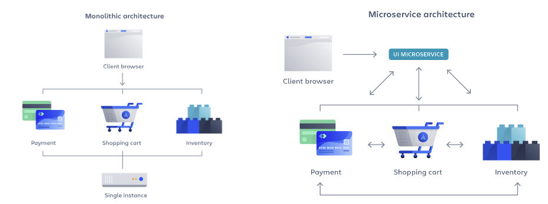
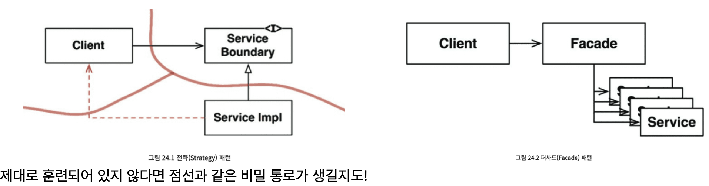

# 24장 부분적 경계

- 아키텍처 경계를 완벽하게 만드는 데는 상당한 비용이 든다.
- 애자일 커뮤니티에서는 이러한 종류의 선행적 설계를 탐탁치 않게 여김
  - YAGNI(You aren’t gonna need it) : 프로그래머가 필요하다고 간주할 때까지 기능 추가 안함
- ”어쩌면 필요할지도” 라는 생각이 들면 부분적 경계(partial boundary)를 구현해볼 수 있다.

## 마지막 단계를 건너뛰기

- 독립적으로 컴파일하고 배포할 수 있는 컴포넌트를 만들기 위한 작업은 모두 수행한 후 단일 컴포넌트에 그대로 모아서 배포한다.
- 다수의 컴포넌트를 관리하는 작업을 하지 않아도 되며, 배포 관리 부담이 적어진다.

## 일차원 경계

- 양방향으로 격리된 상태는 비용이 많이 든다.
  - 양방향으로 완벽히 격리된 상태 유지를 위해 쌍방향 Boundary 인터페이스를 사용한다.
- 추후 완벽한 경계로 확장할 수 있는 공간을 확보하면서, 더 간단한 구조 = 전략 패턴, 퍼사드 패턴

