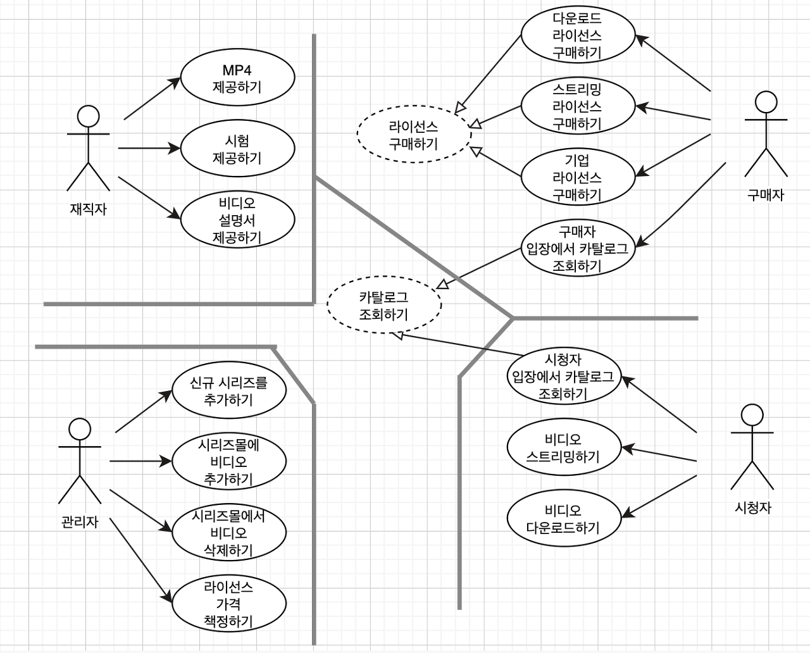
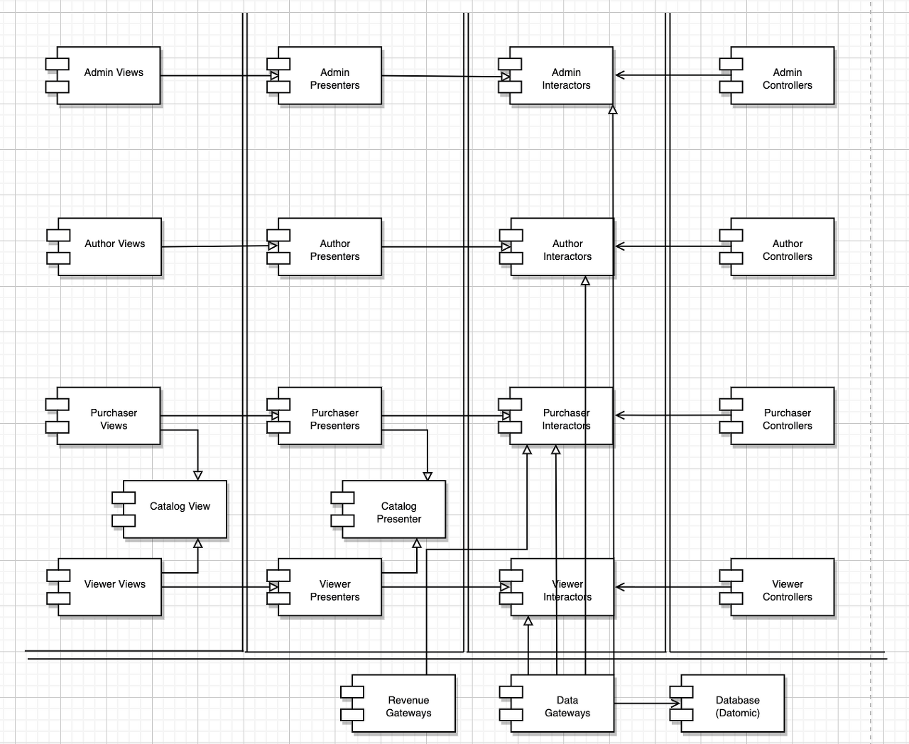

# 33장 사례 연구: 비디오 판매

웹사이트에서 비디오를 판매하는 소프트웨어를 만들자.

초기 아키텍처 결정 첫단계 - 액터와 유스케이스를 식별

## 유스케이스 분석

> 출처: https://hwannny.tistory.com/51
> 
- 시스템의 변경 이유는 네 액터가 주요 원인
    - 특정 액터를 위한 변경이 다른 액터에게 영향을 미치지 못하게 하자.
- 점선 유스케이스는 추상케이스

## 컴포넌트 아키텍처

- 액터와 유스케이스를 식별했으면, 예비 단계의 컴포넌트 아키텍처를 만들어 볼 수 있다.

> 출처: https://hwannny.tistory.com/51
> 

- 이중선 - 아키텍처 경계
- 액터에 따라 카테고리 분리
- 이 컴포넌트를 몇개의 jar로 합쳐서 관리할지는 열어둔다.
    - 배포 방식에 따라서 조정

## 의존성 관리

- 제어흐름은 오른쪽에서 왼쪽으로 이동
- 하지만, 모든 화살표가 오른쪽에서 왼쪽을 가리키지는 않음

## 결론

- 코드를 한 번 구조화하고 나면 시스템을 실제로 배포하는 방식은 다양하게 선택할 수 있게 된다.
