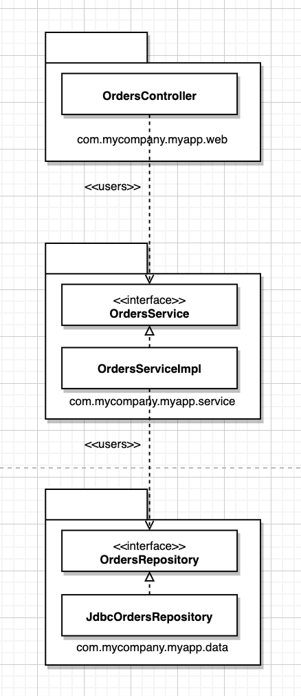
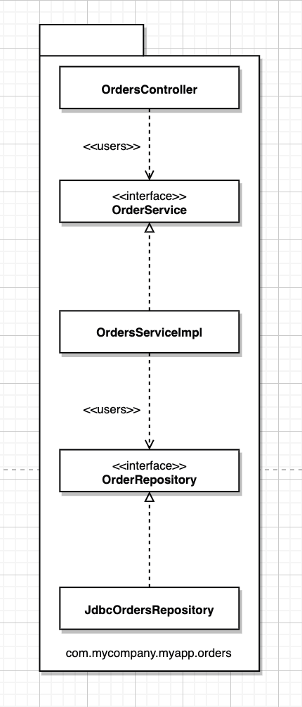
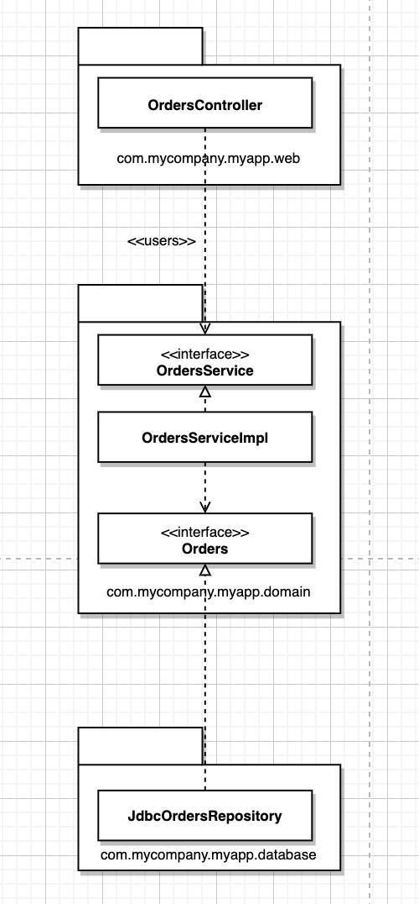
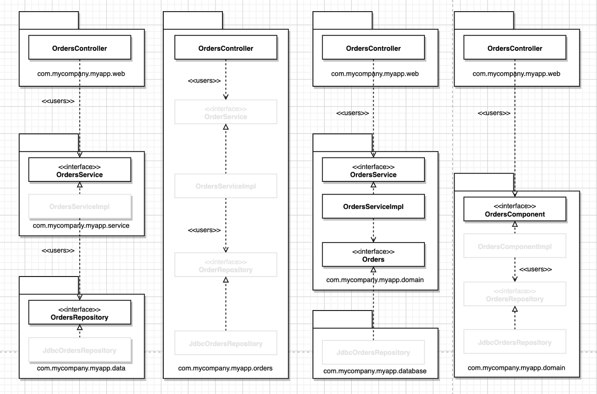

# 34장 빠져 있는 장

온라인 서점에서 고객이 주문 상태를 조회할 수 있는 유스케이스를 구현한다면

## 계층 기반 패키지

- 수평 계층형 아키텍처
- 해당 코드가 하는 일에 기반해 코드를 분할
- 의존성은 모두 아래를 향한다.
  
    
  
    > 출처: https://hwannny.tistory.com/51
    > 
- 가장 빠르게 무언가를 작동시켜주는 방법
- 문제
    - 소프트웨어가 커지고 복잡해지면 세 그릇가지고는 코드는 다 담기에 부족함을 느낄 것
    - 업무 도메인에 대해 아무것도 말해주지 않는다.
        - 전혀 다른 도메인이더라도 아키텍처가 비슷해보인다.

## 기능 기반 패키지

- 서로 연관된 기능, 도메인 개념 또는 Arggregate Root (데이터 변경 단위 연관 객체의 묶음) 에 기반하여 수직으로 코드를 나누는 방식
  
     

> 출처: https://hwannny.tistory.com/51
> 
- 모두가 하나의 패키지에 속하게 된다.
- 장점
    - 코드의 상위 수준 구조가 업무 도메인에 대해 무언가를 알려주게 된다.
        - 이게 이 코드가 주문 관련 일을 한다는 걸 볼 수 있음
    - ‘주문 조회하기’ 유스케이스가 변경될 경우 변경해야 할 코드를 모두 찾는 작업이 쉬워짐
        - 모두 다 한 패키지에 있으니까

## 포트와 어댑터

- ‘포트와 어댑터’, ‘육각형 아키텍처’, ‘경계,컨트롤러, 엔티티’ 등의 방식으로 접근하는 이유는 업무/도메인에 초점을 둔 코드가 프레임워크나 데이터베이스 같은 세부 내용과 독립적이고 분리된 아키텍처를 만들기 위함
- 코드 베이스는 내부(도메인)과 외부(인프라)로 구성되어 있다.
- 주요 규칙
    - 외부 → 내부를 의존해야 한다.

 

> 출처: https://hwannny.tistory.com/51
> 

- com.mycompany.myapp.domain이 내부, 나머지는 외부
- OrderRepository가 Orders로 변경
    - 도메인 기준으로는 주문에 대해 말하는 것이지 OrderRepository를 말하는게 아님

## 컴포넌트 기반 패키지

- 계층형 아키텍처
    - 각 계층을 하나의 패키지로 구성
    - 의존하려면 인터페이스를 public으로 선언해야
    - Controller가 Service를 건너뛰로 바로 Repository를 의존하게 구현하게 될 수도 있다.
    - “**/web 패키지에 있는 타입은 절대 **/data에 있는 타입에 접근하면 안 된다” 같은 규칙을 만들어야 한다.
- 컴로넌트 기반 패키지는 큰 단위의 단일 컴포넌트와 관련된 모든 책임을 하나의 자바 패키지로 묶는다.

 

> 출처: https://hwannny.tistory.com/51
> 

- 업무 로직과 관련된 코드를 하나로 묶음
- 코딩해야 할 때 OrdersComponent만 둘러보면 된다

## 구현 세부사항엔 항상 문제가 있다.

- public 사용 - 캡슐화 이점을 활용하지 않겠다.

## 조직화 vs 캡슐화

- public을 사용하면 패키지는 단순히 조직화를 위한 매커니즘으로 전락한다.
- 앞에서 설명한 네가지 아키텍처는 본질적으로 같아진다.
  
    

> 출처: https://hwannny.tistory.com/51
> 
- 표시되어 있는 부분만 public으로 선언해야한다.

## 다른 결합 분리 모드

- 프로그래밍 언어가 제공하는 방법 외에 모듈로 소스 코드 의존성을 분리하는 방법 존재
- 소스 코드 수준에서 서로 다른 소스 코드로 트리로 분리하여 의존성을 분리하는 방법도 존재
    - 도메인 코드 트리, 인프라 코드 트리 두개로 나누기

## 결론: 빠져 있는 조언

- 최적에 설계를 했어도 구현 전략에 얽힌 복잡함을 고려하지 않으면 설계가 망가질 수 있다.

- 설계를 어떻게해야 원하는 코드 구조로 매핑할 수 있을지 고민하라
- 해당 코드를 어떻게 조직화 할 지 고민하라
- 런타임, 컴파일타임에 어떤 결합 분리모드를 적용할지를 고민하라
- 가능하면 선택사항은 열어두되 실용주의적으로 행하라
- 팀규모, 기술 수준, 해결책의 복잡성을 일정과 예산이라는 제약과 동시에 고려해라
- 선택한 아키텍처 스타일을 강제하는 데 컴파일러의 도움을 받을 수 있는지 고민하라
- 데이터 모델과 같은 영역에 결합되지 않도록 주의하라)

